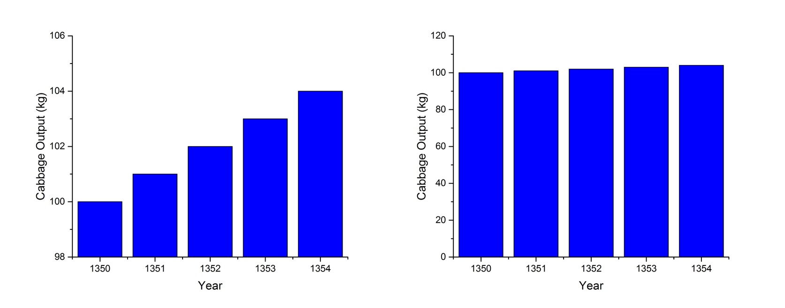

# INSTRUCTIONS:
Edit this file by replacing the instructions with text and code to anser the questions.
I should be able to knit this file and reproduce the html, pdf, or word document.

A block to load in the data:
```{r}
rm(list=ls()) # Clean the workspace to be empty
arbuthnot <- read.csv(file="C:/Users/Emily/Documents/enield/homework1/data/arbuthnot.csv")
```

# Question 1


Plot 1: y-axis set to default scale

```{r}
library(ggplot2) # Open up the plotting program
# Plot with default y-axis scale first 
ggplot(data=arbuthnot) + 
     geom_line(aes(x=Year, y=Males, color='Male')) + 
     geom_line(aes(x=Year, y=Females, color='Females')) + ylab('Christenings') +
    ylab('Christenings') + labs(color='Sex')

```

-Plot 2: y-axis extending all the way to zero

```{r}
ggplot(data=arbuthnot) + 
     geom_line(aes(x=Year, y=Males, color='Male')) + 
     geom_line(aes(x=Year, y=Females, color='Females')) + ylab('Christenings') +
     scale_y_continuous(limits=c(0, 9000)) + # add this to set the values of the y-axis
    ylab('Christenings') + labs(color='Sex')

```


 - Describe the visual appearance of the two plots.  Do they "feel" like they describe the same data? 
 
The plots have the same visual appearance except the plot with the default scale appears to be more exaggerated (ie. deeper wells). Both plots “feel” like they describe the same data when you look at the scaling of the y-axis. If someone were to look at these plots but ignored the scaling then they would “feel” different. For example the first plot makes it appear as though they were almost no babies being christened between 1645-1660 as the lines drop to the bottom of the plot. The top plot also exaggerates the space between the male and female line so that it appears that there are more males to females compared to the bottom plot.
 
 - Describe how you might be able to mislead readers by changing the scaling on graphs. 
 
 It is easy to mislead readers by manipulating the scales of graphs. You can make it appear as though there has been a drastic change between years or groups of data by making the range in the y-axis small. In the example below there is 5 years’ worth of data for cabbage production in the Shire. In the first graph it appears that the cabbage production is increasing rapidly each year. The second graph scales its y-axis starting at zero and it is revealed that the cabbage production has only slightly increased each year. 


 
 - Which plot seems more appropriate here?  Why?

In this scenario the plot showing the y-axis starting at zero is more appropriate. It properly represents the spacing between the male and female lines on the graph thus showing the correct ratio of male to female christenings. 

# Question 2
Scatterplot of male and female christenings

```{r}
ggplot(data=arbuthnot, aes(x=Females, y=Males)) +
    geom_point(shape=1) +    # Use hollow circles
   ylab('Male Christenings') + xlab ('Female Christenings') + # add labels
  geom_abline(intercept = 0, slope = 1) # Insert 45 degree line        
```


  Use this figure to describe the relationship and distribution of Male and Female christenings.
  
  A 45 degree line indicates that there is a slope of 1 meaning that for every one male christened, one female is christened as well. But as shown in the plots in the first question there are slightly more males christened than females which is why the 45 degree line does not fit the data but is a close approximation. The data points all lie above this line which indicates that the ratio between males and females is greater than 1. 


# Question 3

How do you think the christenings-based sample would compared to a births-based sample?  Similar?  Different?  Why?  Arbuthnot's data probably included most every christening in London during this period; they probably aren't any unreported christenings.  Is this fact important?  Why or why not?  Would a christenings based sample be appropriate now, in the 21st century?  (Hint, this last question is trickier than it might seem.  Think about what causes Male/Female Births, what causes people to christen their children, and any relations or not between these)

In the 17th century England christenings took place on the next Sunday or holy day after birth and the almost the entire population was Christian [[1]](http://www.plimoth.org/media/pdf/edmaterials_celebrations.pdf). This would make christening rates very similar to birth rates since the ceremony happens so close to birth. There would be slightly less christenings than births because babies could die from complications due to the birthing process or quickly from infection before they are christened. 

It is important that they have included almost all the christenings in London as this increases the sample size which makes the data more representative of the population. 

Christening based samples would not by appropriate in the 21st century to predict birth rates. According to a 2011 report by the Church of England [[2]](https://www.churchofengland.org/media/1477827/2010_11churchstatistics.pdf) only 60% of children christened in England were under 1 year in age. A lot of factors can cause a child to die in their first few years of life which would cause an underestimation of birthrates if the christening rates were used. Infant mortality is higher in males than females so this would cause an underestimation of male births. 


# Question 4
What does "sex ratio at birth" mean?  How does it depend on biology, cuture and technology.  Consider the three cases of 1) late 17th century England, 2) 21st century US, and China under the [one-child policy](http://en.wikipedia.org/wiki/One-child_policy).

Sex ratio at birth is the number of males to females born and includes both natural and C-section births. Infant mortality is higher in males than in females so the gender imbalance at birth is an evolutionary trait to balance out the genders. This biology can explain the natural sex ratio that is seen in 17th century England. 

Culture can influence the sex ratio. In China males are seen as more valuable than female as they are able to support their parents later in life. More males are being born than feels due to selected abortion of females.

Technology has improved to the point that the gender of the child can be chosen when a couple undergoes in vitro fertilization. In Canada it is illegal to choose the sex of the child but it is legal to do so in the United States. Many wealthy couples are paying to ensure that they get the sex they want and this can skew the sex ratio. 


# Question 5
The purpose of this question is to give you a little practice using standard deviation.

a. The average height of young women ages 18-24 is 64.5 in.  The distribution of heights is approximately normal (Gaussian) with a standardard deviation of $\sigma=2.5$.  Complete this sentence: Approximately 95% of women have a height greater than ______ in and less than ______ in.

If you are within 95% of the mean than you are within 2 standard deviations of the mean. In this example 2 standard deviations is 5 in. Approximately 95% of women have a height greater than 69.5 in and less than 59.5 in.

# Question 6
The purpose of this question is to help you understand the variance.

The formula for sample variance $\sigma^2$ of a dataset is:
$$\frac{\sum_{i=1}^N (x_i - \bar{x})^2}{N-1}$$
Describe in words what each part of this equation is, and using the concept of "distance" describe what the sample variance measures.


When you calculate variance in a sample you start by calculating the mean, $\bar{x}$, then you calculate the distance of each data point, ($x_i$) to the mean (where $i$ ranges from $1$ to $N$, number of data points in sample) to the mean. Square each of these distances and then sum all of them. To find the average distance from the mean, this summation is divided by the number of data points in the sample ($N$) minus 1. Sample variance measure the expected distance of a data point from the mean of the sample. 
