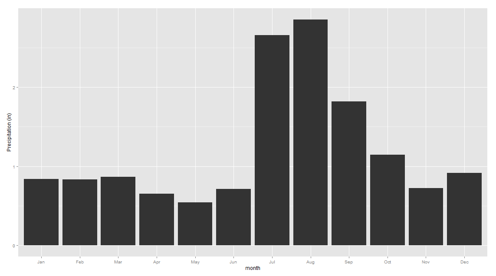
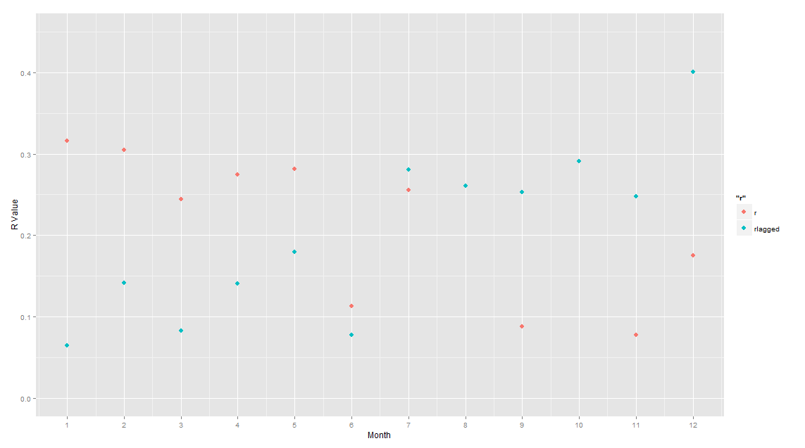
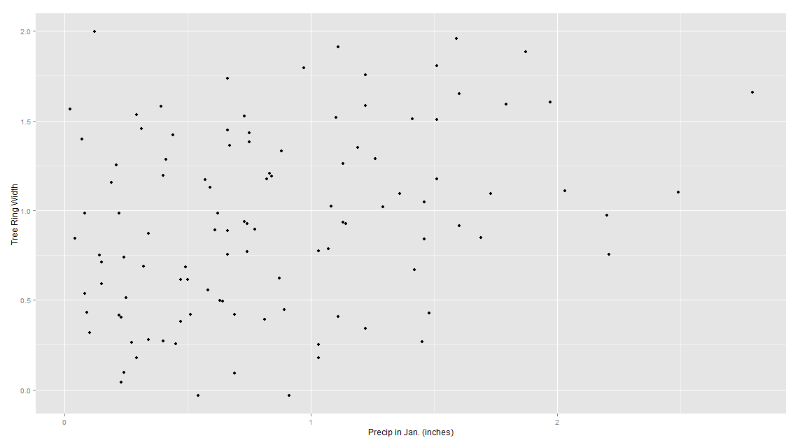
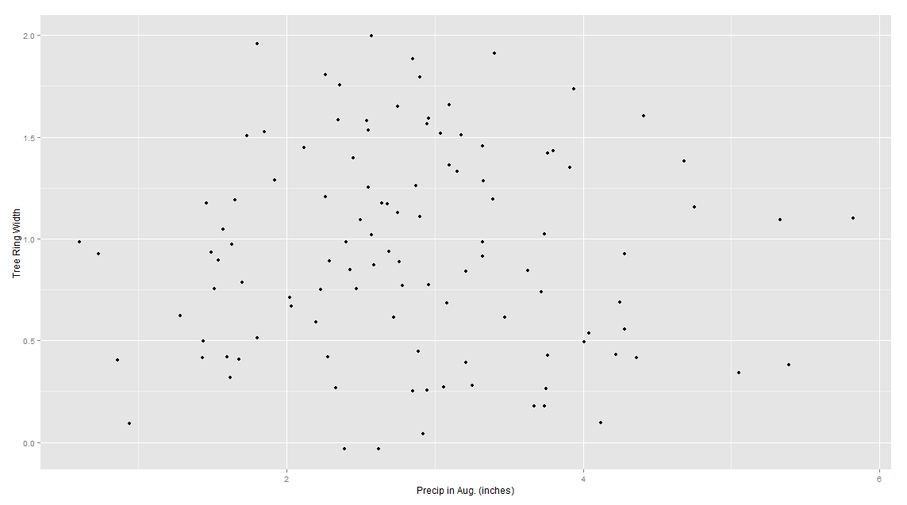

# Part 1. Analysis of El Malpais data

Precipitation is highest in the summer months (July, August) and begins to decline in the fall months. It is relatively constant in the winter months (Jan-Mar) at approximately 0.8 inches and it is at its lowest in the spring months (Apr-Jun). This pattern is shown in the figure below. 

The current December precipitation values has a low correlation with tree ring width of that year because the growing season of the tree is over. So this extra water will not influence the growth of the tree for that current year. The previous December precipitation values have a stronger correlation to the current tree year growth because this water (or snow) is stored right before the growing season begins. One can look at the graph (shown below) and see where the growing season of the tree begins and what month's precipitation affects it the most. The months that have the R-value greater than the R-lagged value are part of the growing season (Jan to June of the current year). The months that have the R-lagged value greater than the R-value influence the growing season by accumulating water (July to December of the previous year). 

This relationship can be seen in the scatter plots of the current January precipitation vs tree ring width and of the current August precipitation vs the tree ring width. The scatter plot of the current January shows a greater correlation than that of the current August. This argues that the current January is part of the tree's growing season but not the current August. 

In summary the tree grows in the summer (June to August) and uses the water that it stores from July of the previous year to June of the current year. The more water that falls in these months the greater the tree can grow. This would make it appropriate to use a linear correlation to describe the relationship between tree ring growth and precipitation. The correlation won't be strong because there are other factors that influence tree growth. 

# Part 2: Getting the interpretation of correlation correct.

1. The following statement is true: A positive correlation between tree ring width and January precipitation might happen if wetter (dryer)-than-average Januarys tend to have bigger (smaller)-than-average tree ring width.

A positive correlation means that as one variable increases (or decreases) the other variable also increases (or decreases). In this statement as the rainfall increased, the tree ring width also increased. Therefore they are positively correlated.

2. In general as the age of the second car increases the price decreases. This describes a negative correlation between the two. The price decreases as a car gets older because it has more kilometers on it and more parts fall apart due to wear and tear making its monetary value decrease. 

As antique cars age they increase in value. So there is a positive correlation between the two. Antique cars represent a small proportion of the overall car market so if they were included with the rest of the aging cars than the correlation between price and age will still be negative but the magnitude of the r value would decrease. 

3. True or False, and explain: if the correlation coefficient is 0.90, then 90% of the points are highly correlated.

False. The magnitude of the correlation coefficient tells you the overall strength of your relationship. R=0.9 does not translate to 90% of the points being highly correlated. This is a measurement of the overall spread of the data from the line of best fit. It takes into account all of the points so if 90% of the data lines up almost perfectly but 10% is highly scattered this will not produce an R-value of 0.9 as there is a large spread in the overall data set.

4.The correlation of 0.4 between the average household income and rates of teenage pregnancy is higher than the actual relationship between the individual household income and teen pregnancy rate. This is due to the Ecological Correlation which states that the aggregation of data changes the correlation of the data.

5. a.  Grade point average in freshman year and sophomore year in college. R=0.6. Between freshman and sophomore year the studying habits of most students will not change significantly. A person with a GPA of 3.2 will most likely maintain that GPA in the next year. 

b.	Grade point average in freshman year and senior year in college. R=0.3. Between freshman and senior year of college the studying habits of an individual will most likely improve so their overall GPA will be higher than their freshman score. But other students might decrease in their overall GPA as their classes become more difficult. This justifies R=0.3

c.	Length and weight of two-by-four boards of lumber. R=0.95. The volume of a 2x4 and its weight is strongly correlated. As the length increases there is more wood therefore it should be heavier. There might be small variations because of the width. 

6. Studies find a negative correlation between hours spent watching television and scores on reading tests.  Does watching television make people less able to read?  Discuss briefly.

A correlation between watching TV and reading test scores does not mean that watching TV causes people to perform poorly on a reading test it just means that there is an association between the two. In general the more TV that a person watches the poorer they perform on reading tests. This could be because a person spends more of their free time watching TV than reading which makes them perform worse. In order to get a complete sense of the picture more variables need to be taken into consideration to see if there could be other causes. This can include the hours spent reading vs the hours watching TV. 